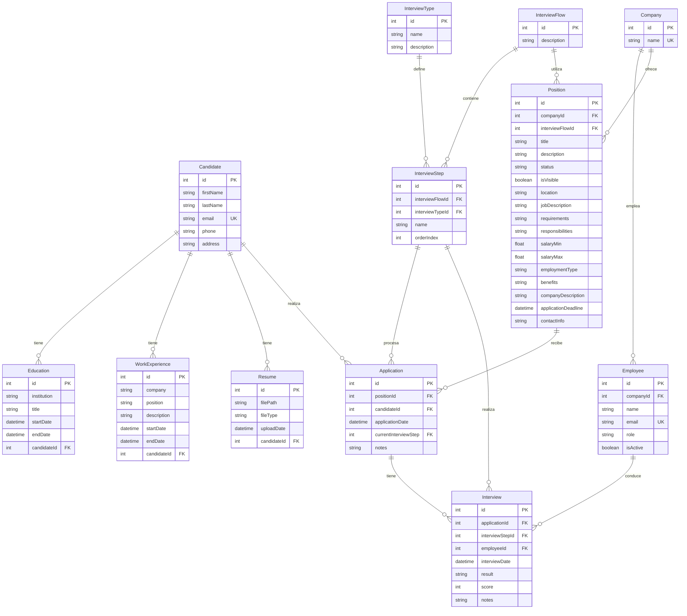

# Esquema de Base de Datos - Proyecto LTI

## Diagrama de Entidad-Relación

## Descripción de Entidades

### Entidades Principales

1. **Candidate**
   - Representa a los candidatos que aplican a posiciones
   - Almacena información personal y de contacto
   - Relacionado con Education, WorkExperience, Resume y Application

2. **Company**
   - Representa las empresas que publican posiciones
   - Contiene información básica de la empresa
   - Relacionado con Employee y Position

3. **Position**
   - Representa las posiciones laborales disponibles
   - Contiene detalles completos de la oferta laboral
   - Relacionado con Company, InterviewFlow y Application

4. **Application**
   - Representa las aplicaciones de candidatos a posiciones
   - Almacena el estado y progreso de la aplicación
   - Relacionado con Candidate, Position e Interview

### Entidades de Proceso

1. **InterviewFlow**
   - Define el flujo de entrevistas para una posición
   - Contiene los pasos de entrevista en orden
   - Relacionado con Position e InterviewStep

2. **InterviewStep**
   - Define un paso específico en el proceso de entrevista
   - Asociado con un tipo de entrevista
   - Relacionado con InterviewFlow y Interview

3. **Interview**
   - Registra las entrevistas realizadas
   - Almacena resultados y notas
   - Relacionado con Application, InterviewStep y Employee

### Entidades de Soporte

1. **Education**
   - Registra la formación académica de los candidatos
   - Relacionado con Candidate

2. **WorkExperience**
   - Registra la experiencia laboral de los candidatos
   - Relacionado con Candidate

3. **Resume**
   - Almacena los currículums de los candidatos
   - Relacionado con Candidate

4. **Employee**
   - Representa a los empleados de las empresas
   - Pueden realizar entrevistas
   - Relacionado con Company e Interview

## Relaciones Principales

1. **Candidato - Aplicación**
   - Un candidato puede tener múltiples aplicaciones
   - Cada aplicación pertenece a un único candidato

2. **Empresa - Posición**
   - Una empresa puede tener múltiples posiciones
   - Cada posición pertenece a una única empresa

3. **Posición - Flujo de Entrevista**
   - Una posición tiene un flujo de entrevista definido
   - Un flujo de entrevista puede ser usado por múltiples posiciones

4. **Aplicación - Entrevista**
   - Una aplicación puede tener múltiples entrevistas
   - Cada entrevista pertenece a una única aplicación

## Consideraciones de Diseño

1. **Integridad Referencial**
   - Todas las relaciones están protegidas con claves foráneas
   - Se mantiene la integridad de los datos

2. **Normalización**
   - El esquema sigue las reglas de normalización
   - Minimiza la redundancia de datos

3. **Escalabilidad**
   - Diseño que permite el crecimiento de datos
   - Estructura optimizada para consultas frecuentes

4. **Flexibilidad**
   - Permite diferentes tipos de procesos de entrevista
   - Adaptable a diferentes necesidades de negocio 